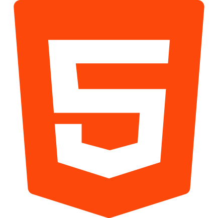
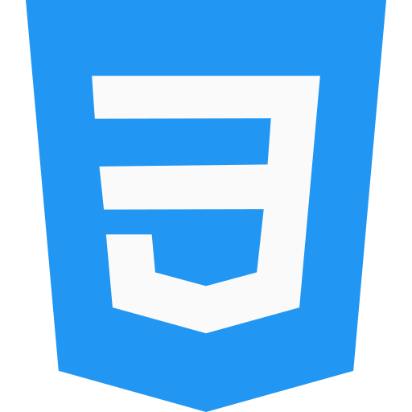
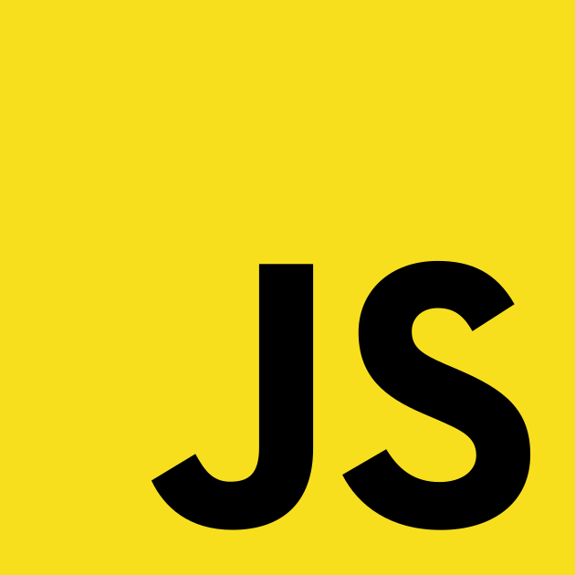

<h1>LeoBezr</h1>

   <strong>👋 Heey! 
      I'm Leo Bezerra,</strong>

Currently, I live in Brazil and work at Fintask, a financial startup.

<h3>🧙 My Development Toolbelt</h3>

          

<h3>👨‍💻 My Personal Project</h3>

   <strong>⚔ <a href="https://knights-rpg.com.br/#/" target="_blank" rel="nofollow">Knights RPG</a></strong> 
   A RPG browser game, developed in NodeJs and VueJS using Canvas and WebSockets.

   <strong>⚔ <a href="http://leobezr.com.br/" target="_blank" rel="nofollow">Portfolio</a></strong> 
   You can find some of my latest projects here.

