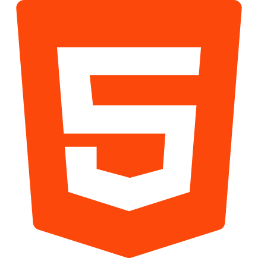
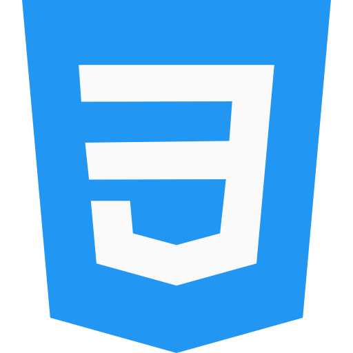
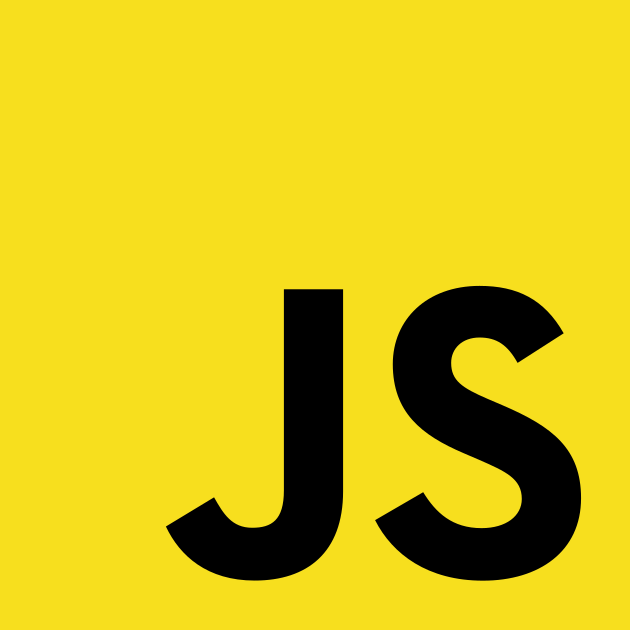
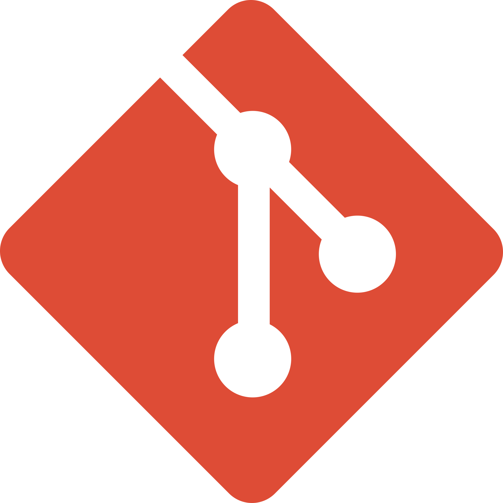
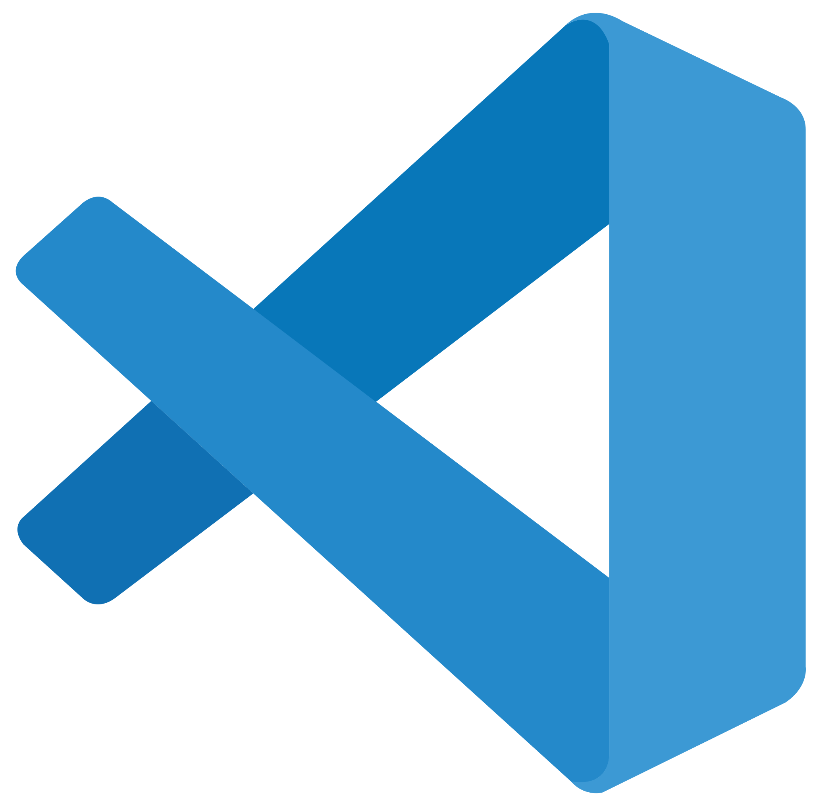

<h1>Rzeb</h1>

   <strong>👋 Heey! 
      I'm Leo, some know me by Rzeb</strong>

Currently, I live in Portugal and work at PrimeIT Nearshore.

<h2>🧙 My Development Toolbelt</h2>

          

## 🚀 Who am I

Well, like any other programmer <strong>I LOVE</strong> code, but one of my unique traits is that I love innovating, I don't follow a line just because everyone "thinks" it's the best choice, I try to create my own flow. This doesn't mean that I don't know how to work as a team member and respect certain ideas and cultures, it means that I will try my best to optimize every single task, instead of accepting the bare minimum, I'm an Architect by nature, love spreading knowledge and guidance to those who need it and are open to it.

10+ years working as a software engineer

